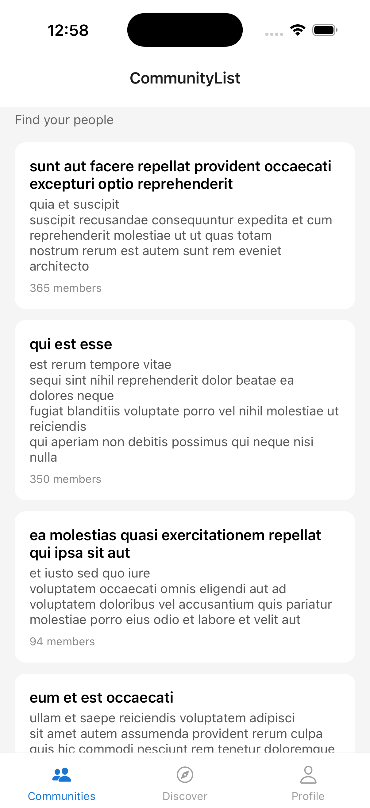
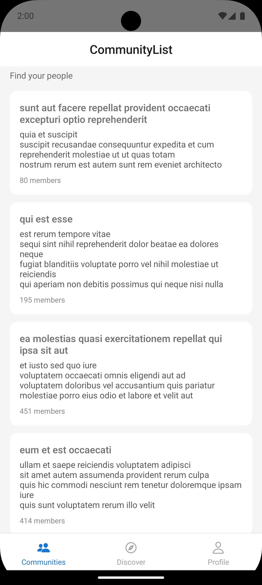

<h1>📱 Community Hub Mobile App</h1>

A <b>React Native</b> mobile application built as part of a senior-level assignment to demonstrate
strong fundamentals in <b>architecture</b>, <b>state management</b>, <b>API integration</b>,
<b>optimistic UI updates</b>, and <b>offline handling</b>.

<h2>🚀 Setup Instructions</h2>

<pre>
npm install
cd ios && pod install && cd ..
npx react-native start --reset-cache
npm run ios     # Run on iOS
npm run android # Run on Android
</pre>

<h2>🧠 App Concept</h2>

A <b>Community Hub</b> app where users can browse communities, view details and posts,
join or leave communities, and create simple posts with a smooth and resilient user experience.

<h2>🧩 Features Implemented</h2>

<h3>1️⃣ Authentication (Mocked)</h3>
<ul>
  <li>Simple <b>Login Screen</b> with email & password</li>
  <li>No real backend authentication</li>
  <li>Stores a <b>fake token</b> locally on login</li>
  <li>Session persists across app restarts</li>
  <li>On relaunch:
    <ul>
      <li>If token exists → user is taken to <b>Community List</b></li>
      <li>If not → <b>Login Screen</b> is shown</li>
    </ul>
  </li>
</ul>

<h3>2️⃣ Community List</h3>
<ul>
  <li>Communities fetched from <b>JSONPlaceholder API</b></li>
  <li>Each community displays:
    <ul>
      <li><b>Name</b></li>
      <li><b>Description</b></li>
      <li><b>Member Count</b></li>
    </ul>
  </li>
  <li>Supports <b>pagination / infinite scroll</b></li>
  <li>Supports <b>pull-to-refresh</b></li>
  <li>Efficient list rendering using <b>FlatList</b></li>
  <li>Graceful loading states</li>
</ul>

<h3>3️⃣ Community Details</h3>
<ul>
  <li>Tap a community to open its <b>details screen</b></li>
  <li>Displays:
    <ul>
      <li>Community header information</li>
      <li>Status (Active / Inactive)</li>
      <li>List of posts</li>
    </ul>
  </li>
  <li><b>Join / Leave</b> community functionality</li>
  <li>Join state managed locally using <b>Zustand</b></li>
</ul>

<h3>4️⃣ Posts</h3>
<ul>
  <li>Posts fetched per community</li>
  <li>Users can <b>create a new post</b> with:
    <ul>
      <li>Title</li>
      <li>Body</li>
    </ul>
  </li>
  <li><b>Optimistic UI updates</b> using React Query mutations</li>
  <li>Post appears immediately in the list</li>
  <li>Loading & error states handled properly</li>
</ul>

<h3>5️⃣ Offline & Error Handling</h3>
<ul>
  <li>Network status tracked using <b>@react-native-community/netinfo</b></li>
  <li>Offline banner shown when the user is disconnected</li>
  <li>API failures handled gracefully</li>
  <li>App does <b>not crash</b> on network failures</li>
</ul>

<h2>🛠 Tech Stack</h2>
<ul>
  <li><b>React Native</b> (0.73.x)</li>
  <li><b>TypeScript</b></li>
  <li><b>React Navigation</b> (Stack + Bottom Tabs)</li>
  <li><b>@tanstack/react-query</b> for server state & caching</li>
  <li><b>Zustand</b> for lightweight client state</li>
  <li><b>AsyncStorage</b> for persistence</li>
</ul>

<h2>📂 Project Structure</h2>
<pre>
src/
 ├── api/            # API layer (communities, posts)
 ├── hooks/          # Custom hooks (queries, mutations, network)
 ├── navigation/     # Navigators & route types
 ├── screens/        # App screens
 ├── store/          # Zustand stores
 ├── components/     # Reusable UI components
 └── types/          # TypeScript types
</pre>

<h2>🧠 Key Decisions & Tradeoffs</h2>
<ul>
  <li>Used <b>React Query</b> for server state to handle caching, retries, and optimistic updates</li>
  <li>Used <b>Zustand</b> for client-only state (auth, join/leave) to avoid Redux boilerplate</li>
  <li>Kept backend mocked to focus on architecture and UX</li>
  <li>Separated server state and UI state intentionally for scalability</li>
</ul>

<h2>🚧 Known Limitations</h2>
<ul>
  <li>Backend is fully mocked (JSONPlaceholder)</li>
  <li>Created posts are not persisted on server (API limitation)</li>
  <li>React Query cache persistence across restarts not implemented</li>
</ul>

<h2>🔮 What I’d Improve With More Time</h2>
<ul>
  <li>Persist React Query cache across app restarts</li>
  <li>Add offline mutation queueing</li>
  <li>Skeleton loaders instead of spinners</li>
  <li>E2E tests using Detox</li>
  <li>Extract a small design system (colors, spacing, typography)</li>
</ul>

<h2>📸 Screenshots</h2>

<h3>Community List (Home)</h3>

  
  

<i>
Built with focus on clean architecture, type safety, performance awareness,
and real-world React Native patterns.
</i>

